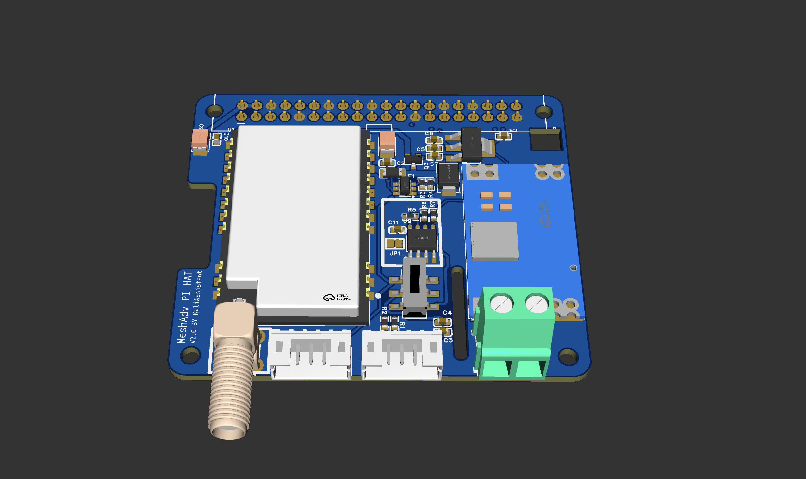
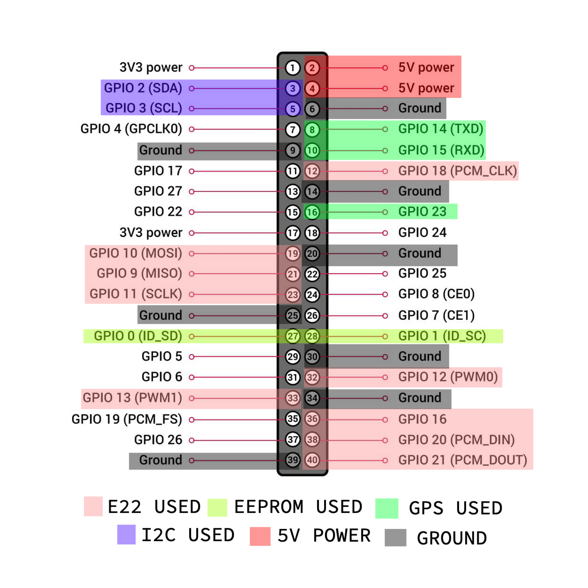

# MeshAdv Pi HAT v2
[ZH_TW](./README_ZH_TW.md)

MeshAdv Pi HAT v2 is a "true" Raspberry Pi HAT that uses the high-power EBYTE E22 module. This design is intended for Linux-native Meshtastic, called "meshtasticd." It is referred to as "true" because the PCB includes the Raspberry Pi Foundation's officially recommended PCB dimension style, an onboard identification I2C EEPROM, and a ZVD circuit for reverse power protection to the Raspberry Pi.

This PCB design uses the 2W 33dBm EBYTE E22900M33S(TW) high-power module. To supply the module's average 1.2A transmission current, I directly use a Mini560 12V to 5V 5A DC-DC buck converter module and designed a ZVD circuit that can also power the Raspberry Pi. The PCB reserves PH2.0 5-pin interfaces for GPS and I2C. The GPS interface includes a 3.3V/5V switch, allowing you to select the VCC voltage for your GPS module. You can also choose whether you need an SMA connector or just use the IPEX connector on the module. Optional configurations on the PCB are marked with thick white silkscreen boxes, including SMA and EEPROM.



## Notes

1. Do not power the E22 module without an antenna or a 50Ω load connected, as this may damage the module.
2. Set the power in Meshtasticd to a maximum of 8dBm. Testing shows that with an 8dBm setting, the module's PA output is 32.8dBm. Exceeding 8dBm may risk damaging the PA.

## Design and Known Issues

1. If the HAT is not connected to an external 12V power source, the E22 module is protected by the ZVD circuit, so there is no concern about the module drawing power from the Raspberry Pi.  
   __However__, since my design does not take 3.3V from the Raspberry Pi but instead uses the buck converter's 5V output with an AMS1117 3.3V regulator, the onboard __EEPROM__ also draws 3.3V from the AMS1117. Testing shows that the AMS1117 output has an unknown 1.8V voltage, which pulls down the Raspberry Pi's I2C-0 interface, causing severe lag in `i2cdetect`.  
   To use EEPROM, always use an external 12V power source.  
   If not using EEPROM, __do not solder any components inside the white silkscreen box__. This issue will be fixed in version V2.1. There is no risk of damaging components since all circuits have current-limiting resistors for protection.

2. If using the E22900M __30S__, the resettable fuse next to the module should be rated at __1A__. The maximum current of the E22900M __30S__ is __700mA__.

3. This PCB design has __extensive copper pour for thermal considerations__, directly merging ground planes.  
   __Use a hot plate or hot air gun for PCBA assembly whenever possible__.  
   If you must use a soldering iron, __preheat the board first__, or soldering will be __very difficult__.

## Pinout



## Compatibility  
__Tested only on Raspberry Pi 4B__

## Installing Meshtasticd  
Follow the official guide: [link](https://meshtastic.org/docs/hardware/devices/linux-native-hardware/)

## Configuration  
Follow the official method and add the following content to a new YAML configuration file: [link](https://meshtastic.org/docs/hardware/devices/linux-native-hardware/#configuration)

```yaml
Lora:
  Module: sx1262  # Ebyte E22-900M30S and E22-900M33S 
# Module: sx1268  # Ebyte E22 400M30S and E22-400M33S
  CS: 21
  IRQ: 16
  Busy: 20
  Reset: 18
  TXen: 13
  RXen: 12
  DIO3_TCXO_VOLTAGE: true
  SX126X_MAX_POWER: 8  # 8=33dBm output. Ebyte E22-900M33S and E22-400M33S only

GPS:
  SerialPath: /dev/ttyS0

I2C:
  I2CDevice: /dev/i2c-1

Logging:
  LogLevel: info # debug, info, warn, error

Webserver:
  Port: 443 # Port for Webserver & Webservices
  RootPath: /usr/share/meshtasticd/web # Root Dir of WebServer

General:
  MaxNodes: 200
```
## EEPROM
The onboard EEPROM is part of the official Raspberry Pi HAT standard, used for identifying manufacturers, loading drivers, DeviceTree, etc. In this project, I only include identification data, which you can fully customize.

To write to the EEPROM, short the JP1 jumper pad on the PCB; otherwise, write protection remains enabled. After writing, remove the short on JP1 to prevent accidental data corruption by the Raspberry Pi.

Refer to the official Raspberry Pi repositories for details:

- https://github.com/raspberrypi/hats
- https://github.com/raspberrypi/utils/tree/master/eeptools

## Open Source License
The full name of MeshAdv Pi HAT v2 is __"Meshtastic Advanced Pi HAT Version 2."__ This project is licensed under CERN OHL-P v2.

I will not sell PCBs, components, or assembled products of this project through any channel.

If you have any questions, feel free to open an issue or contact me via email:
work.kaliassistant.github@gmail.com
