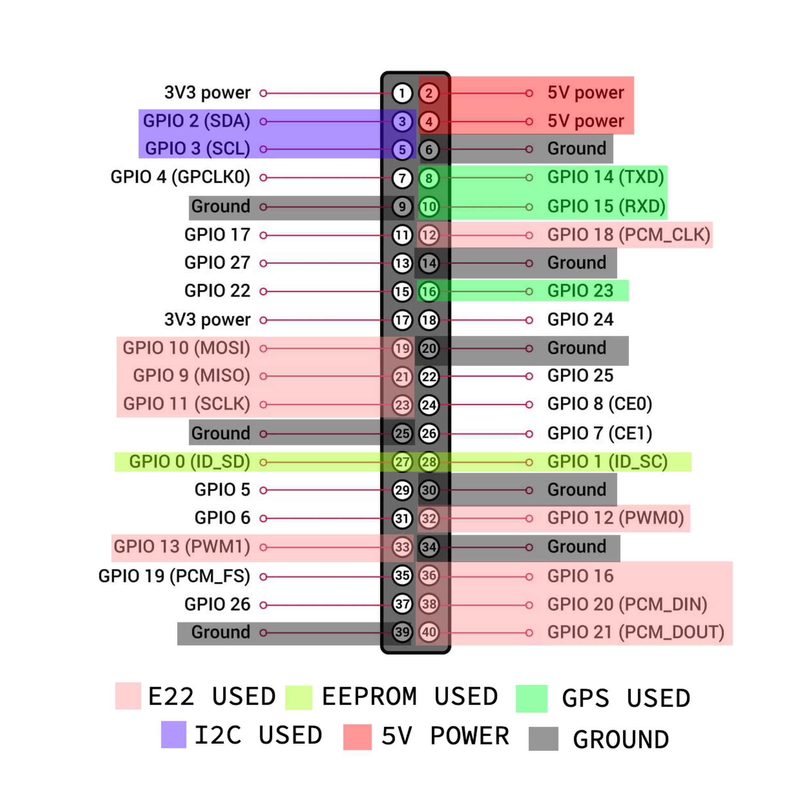

# MeshAdv Pi HAT v2

 MeshAdv Pi HAT v2  是一個使用EBYTE E22大功率模組的樹莓派"真正"HAT, 這個設計用於Linux-Native的Meshtastic, 稱為"meshtasticd". 稱為"真正"的原因是該PCB包括樹莓派基金會官方建議的PCB尺寸樣式,板載用於識別的I2C EEPROM,及對樹莓派反向供電的ZVD電路.

此PCB設計使用EBYTE E22900M33S(TW) 的2W 33dBm大功率模組,為了提供此模組平均1.2A的發射電流,我直接使用Mini560的12V to 5v 5A的DC2DC降壓模組,並設計了ZVD電路可以順便為樹莓派供電. 我在PCB上預留了GPS, I2C的PH2.0 5Pin接口,其中GPS我設計了3V3/5V switch, 可以為你的GPS模組選擇VCC電壓. 你還可以選擇你是否需要SMA接口,或者是至使用模組上的IPEX接口,PCB上的可選方案我都有用粗的白色方匡絲印標記,包括SMA與EEPROM.


## 注意事項

1. 請勿在E22模組尚未連接天線或50Ω負載的情況下連接電源,否則可能會損壞E22模組.
2. Meshtasticd 的功率請設定為最大8dBm. 經過測試, 設定8dBm 時, 模組的PA輸出為32.8 dBm. 否則超過8dbm將會有燒壞PA的風險.

## 設計和已知問題

1. 如果HAT在未接12V外部供電的情況下,E22模組因為有ZVD電路保護的關係,所以不用擔心模組會向樹莓派取電. __但是__ 因為我的設計並沒有向樹莓派取得3.3V電源,而是透過降壓模組的5V電源經過AMS1117 3.3V穩壓電路取得, 而板載 __EEPROM__ 向AMS1117取得3.3V, 經過測試, AMS1117端會有1.8V的未知電壓,會拉低樹莓派的I2C-0接口,造成i2cdect會出現嚴重卡頓的現象,所以如果要使用EEPROM, 請始終使用12V外部電源. 如果未使用EEPROM, __請不要在白色方匡絲印內焊接任何元件__ ,這個問題會在V2.1版本改進,也不用擔心會損害任何元件,因為都有限流電阻保護.

2. 如果使用 E22900M __30S__ , 模組旁邊的自恢復保險絲請使用 __1A__ 的規格. E22900M __30S__ 的最大電流為 __700MA__

3. 此PCB設計為了 __散熱考量__ ,大面積的鋪銅與地線直接合併, __請盡量使用加熱台或熱風槍做PCBA__ . 如果真的要用烙鐵焊接, __請務必先進行預熱__ ,否則你會焊接的 __非常痛苦__

## 腳位定義



## 相容性
__我只有在樹莓派4B測試過__

## 安裝Meshtasticd
請按照官方說明: [ link ](https://meshtastic.org/docs/hardware/devices/linux-native-hardware/)

## 配置
按照官方的方法,新增下面內容為新的YAML設定檔 [ link ](https://meshtastic.org/docs/hardware/devices/linux-native-hardware/#configuration)

```yaml
Lora:
  Module: sx1262  # Ebyte E22-900M30S and E22-900M33S 
# Module: sx1268  # Ebyte E22 400M30S and E22-400M33S
  CS: 21
  IRQ: 16
  Busy: 20
  Reset: 18
  TXen: 13
  RXen: 12
  DIO3_TCXO_VOLTAGE: true
  SX126X_MAX_POWER: 8  # 8=33dBm output. Ebyte E22-900M33S and E22-400M33S only

GPS:
  SerialPath: /dev/ttyS0

I2C:
  I2CDevice: /dev/i2c-1

Logging:
  LogLevel: info # debug, info, warn, error

Webserver:
  Port: 443 # Port for Webserver & Webservices
  RootPath: /usr/share/meshtasticd/web # Root Dir of WebServer

General:
  MaxNodes: 200
```

## EEPROM
板載EEPROM是成為官方標準Raspberry Pi HAT 的一部份,用來識別製造廠商,載入驅動,DeviceTree等功能.在此項目我只有加入識別資料,你可以完全自定義.

如果要寫入EEPROM, 請把PCB上的JP1 JUMPER焊盤短路,否則不會解除寫入保護. 寫入完成後請記得清除J1 JUMPER的焊盤, 以免樹莓派意外寫入造成資料損毀.

請詳細閱讀樹莓派官方的Repo :

https://github.com/raspberrypi/hats

https://github.com/raspberrypi/utils/tree/master/eeptools


## 開源許可
MeshAdv Pi HAT v2 的全名為"Meshtastic Advanced Pi HAT Version 2" . 此項目受CERN OHL-P v2許可證約束

我不會在任何通路販售此項目的PCB,零件或者是組裝好的產品

有任何問題可以開一個issue或者是透過此Email聯繫到我: work.kaliassistant.github@gmail.com

